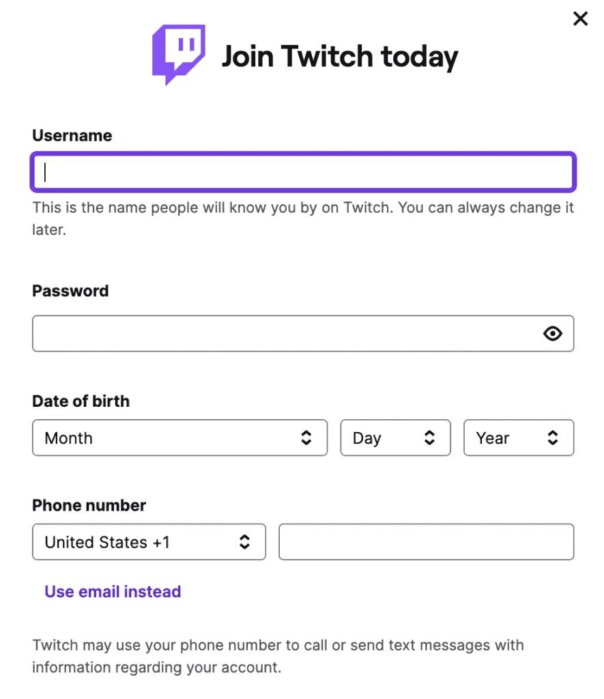
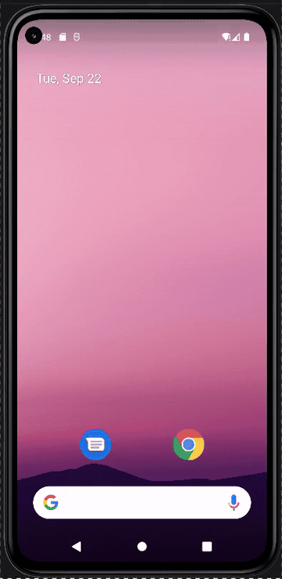

<!-- (This is a comment) INSTRUCTIONS: Go through this page and fill out any **bolded** entries with their correct values.-->

# AND101 Project 3 - AnimalApps

Submitted by: **Christian Ramirez**

Time spent: **2** hours spent in total

## Summary

**PawStream** is an Android app that recreates the Twitch sign-up screen with an animal theme. The app uses a paw logo and recreates the username, password, date of birth, and phone number sections of the original Twitch layout.

If I had to describe this project in three (3) emojis, they would be: **🐾 📱 💜**

## Application Features

<!-- (This is a comment) Please be sure to change the [ ] to [x] for any features you completed.  If a feature is not checked [x], you might miss the points for that item! -->

The following REQUIRED features are completed:

- [x] Pick an app screenshot to duplicate
    - Be sure to add the screenshot to "Chosen Screenshot" below.
- [x] Create a runnable app that displays an Animal Version of your chosen screenshot
- [x] Layout uses one (1) or more ConstraintLayout
- [x] Layout uses one (1) or more ImageView
- [x] Layout uses three (3) or more TextViews

The following STRETCH features are implemented:

- [ ] Create a custom-shape Button using Shape Drawables
- [ ] Customize the text fonts by creating new Font Resources
- [ ] Add Tooltips to your Views to help users understand how to navigate the UI
- [ ] Create a second layout, this time for an original, personal app idea

The following EXTRA features are implemented:

- [x] Added custom border Shape Drawables to make the input fields look more like the original Twitch layout.

## Chosen Screenshot

I have chosen to duplicate the following layout from the **Twitch** app:

## Video Demo

Here's a video / GIF that demos all of the app's implemented features:

GIF created with **ScreentoGif**

<!-- Recommended tools:
- [Kap](https://getkap.co/) for macOS
- [ScreenToGif](https://www.screentogif.com/) for Windows
- [peek](https://github.com/phw/peek) for Linux. -->

## Original App Layout (Optional Stretch Feature)

I did not do this optional stretch feature

## Notes

This project helped me learn how to use ConstraintLayout, ImageView, TextView, EditText, and Shape Drawables in Android Studio. I also learned how to use constraints and margins to position UI elements and recreate an existing app layout.

## License

Copyright **2026** **Christian Ramirez**

Licensed under the Apache License, Version 2.0 (the "License");
you may not use this file except in compliance with the License.
You may obtain a copy of the License at

    http://www.apache.org/licenses/LICENSE-2.0

Unless required by applicable law or agreed to in writing, software
distributed under the License is distributed on an "AS IS" BASIS,
WITHOUT WARRANTIES OR CONDITIONS OF ANY KIND, either express or implied.
See the License for the specific language governing permissions and
limitations under the License.